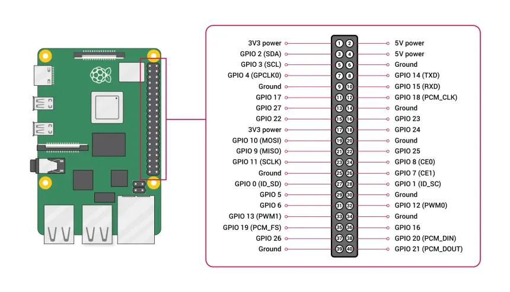
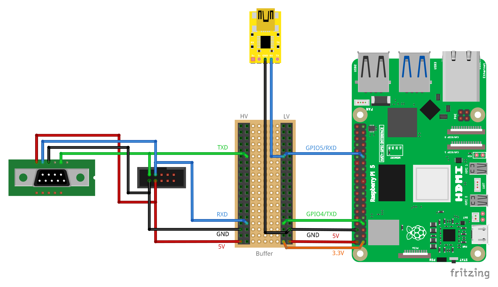

# Raspberry Pi

- Raspberry Pi 5
- UART Documentation: [Raspberry Pi UART](https://www.raspberrypi.com/documentation/computers/configuration.html#configure-uarts)

## Rasberry Pi 5 Pinout

## Hardware Pin Connections

